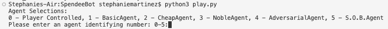

# SpendeeBot
This machine plays splendor. The controls and example scripts are described directly below. After that, important files to view the code are described.

Controls:
---------
There are only two actions "Take" (t) and "buy" (b)
t takes up to 3 coins of any available colors with the format

Script format: t(color)(color)(color)

Script example: tgwg

This examples takes 1 green, 1 white, and another green chip.
Acceptable colors are b (blue) r (red) g (green) k (black) and w (white).

b buys a card if possible with the format

Script format: b(row)(column)

row is an integer from 1-3 refering to the level of the card. More expensive cards are higher levels
column is an interger from 1-4 refering to the position of the card on that row.
The leftmost card is 1 the rightmost card is 4.

Script example: b14

This example buys the 4th card card from the 1st tier. If the player cannot actually afford the card,
an error will be thrown.

Starting the game:
------------------
 Initiate by entering "python3 play.py" in the terminal. Afterwards, you will be asked to enter a number from 0 to 5 to choose an agent to play against. Enter a single number and enter another number for the second player. The game should then start. 

0 - Player Controlled

1 - BasicAgent

2 - CheapAgent

3 - NobleAgent

4 - AdversarialAgent

5 - S.O.B.Agent

Example script: Upon initiating, you will see this screen:
-------------------------------------------------------------------------------------------------------

-------------------------------------------------------------------------------------------------------
If you type '5' and press enter, you set player 1 to be the S.O.BAgent. Using the same process, you can set player 2 with any integer in [0, 5]. If you want to play, simply type in '0' and enter when prompted for either player.

How to read board state:
------------------------
After each turn, the board state is printed. Here is an example:

-------------------------------------------------------------------------------------------------------

-------------------------------------------------------------------------------------------------------

There are three tiers of cards that can be bought using the number of chips and card colors a player has. For example, in tier 1, the first card is [white1|b0r0g4k0w0]. This means this card has gem color white and is worth 1 point. Additionally, this card costs only 4 green chips. A player can purchase this card using a combination of green chips and green cards that they hold. Once bought, the player then holds a white card which can help to buy other cards. We set the point goal to 15 points, so once either player hit or passes this, the game should terminate and print the best player.

Important code files:
---------------------

play.py - We defined our AI agents and initiate the game here. 

game.py - We defined the mechanics of each aspect of the game Splendor here, such as Card, ChipStack, SplendorPlayerGameState, etc. 

